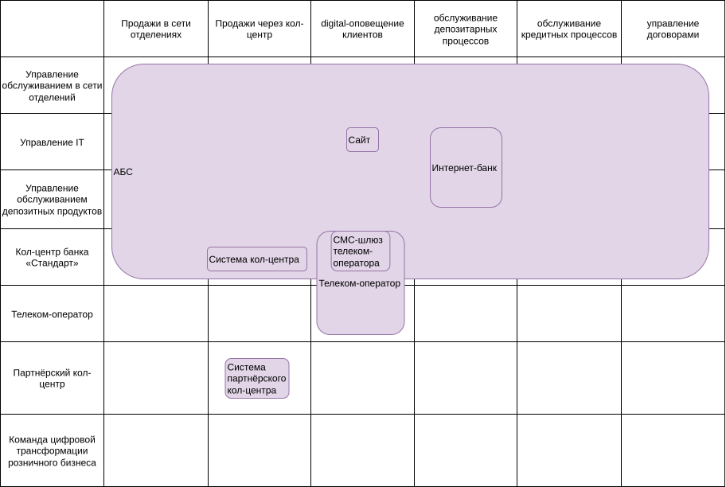
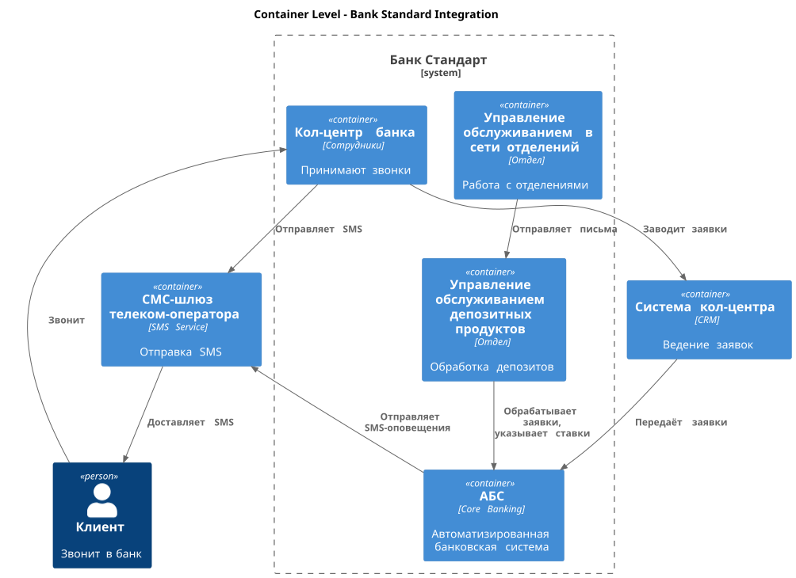

## Карта текущего IT-ландшафта
диаграмма в .drawio <br>
[Карта текущего IT-ландшафта](./it-landscape-diagram.xml)

То же самое в виде картинки:



<details>
  <summary>Заметки</summary>
  
Структура компании (строки):
- Управление обслуживанием в сети отделений
- Управление IT
- Управление обслуживанием депозитных продуктов
- Кол-центр банка «Стандарт»
- Партнёрский кол-центр
- Команда цифровой трансформации розничного бизнеса  

IT-ландшафт (пересечение):
- Интернет-банк
- АБС
- Система кол-центра
- Система партнёрского кол-центра
- СМС-шлюз телеком-оператора
- Телеком-оператор
- Сайт

Бизнес возможности (колонки):
- продажи и маркетинг
    - продажи в сети отделений
    - продажи через кол-центр
    - digital-оповещение клиентов

- поддержка операционных процессов
    - обслуживание депозитарных процессов
    - обслуживание кредитных процессов
    - управление договорами
</details>


## Схема интеграции приложений



<details>
  <summary>Заметки</summary>

Структура компании:
- Управление обслуживанием в сети отделений
- Управление IT
- Управление обслуживанием депозитных продуктов
- Кол-центр банка «Стандарт»
- Партнёрский кол-центр
- Команда цифровой трансформации розничного бизнеса  

Взаимодействия:
- Кол-центр банка «Стандарт» взаимодействует с Системой кол-центра. Принимают звонки от клиентов через нее. Заводят в ней заявки.
- Заявки из Системы кол-центра передаются в АБС.
- Кол-центр банка «Стандарт» взаимодействует с СМС-шлюз телеком-оператора
- Управление обслуживанием в сети отделений взаимодействует с Управление обслуживанием депозитных продуктов через отправку писем. 
- Управление обслуживанием депозитных продуктов взаимодействует с АБС. Обрабатывает в АБС заявки поступившие из Системы кол-центра, указывает ставку по заявке в АБС, после чего АБС отправляет клиенту смс-оповещение.

```plantuml
@startuml
!include https://raw.githubusercontent.com/plantuml-stdlib/C4-PlantUML/master/C4_Container.puml

title Container Level - Bank Standard Integration

Person(client, "Клиент", "Звонит в банк")

System_Boundary(bank_standard, "Банк Стандарт") {
    Container(call_center, "Кол-центр банка", "Сотрудники", "Принимают звонки")
    Container(branch_service, "Управление обслуживанием в сети отделений", "Отдел", "Работа с отделениями")
    Container(deposit_service, "Управление обслуживанием депозитных продуктов", "Отдел", "Обработка депозитов")
    Container(abs_system, "АБС", "Core Banking", "Автоматизированная банковская система")
}

Container(call_center_system, "Система кол-центра", "CRM", "Ведение заявок")
Container(sms_gateway, "СМС-шлюз телеком-оператора", "SMS Service", "Отправка SMS")

Rel(client, call_center, "Звонит")

Rel(call_center, call_center_system, "Заводит заявки")

Rel(call_center_system, abs_system, "Передаёт заявки")
Rel(call_center, sms_gateway, "Отправляет SMS")

Rel(branch_service, deposit_service, "Отправляет письма")
Rel(deposit_service, abs_system, "Обрабатывает заявки,\nуказывает ставки")

Rel(abs_system, sms_gateway, "Отправляет SMS-оповещения")
Rel(sms_gateway, client, "Доставляет SMS")

@enduml
```
</details>