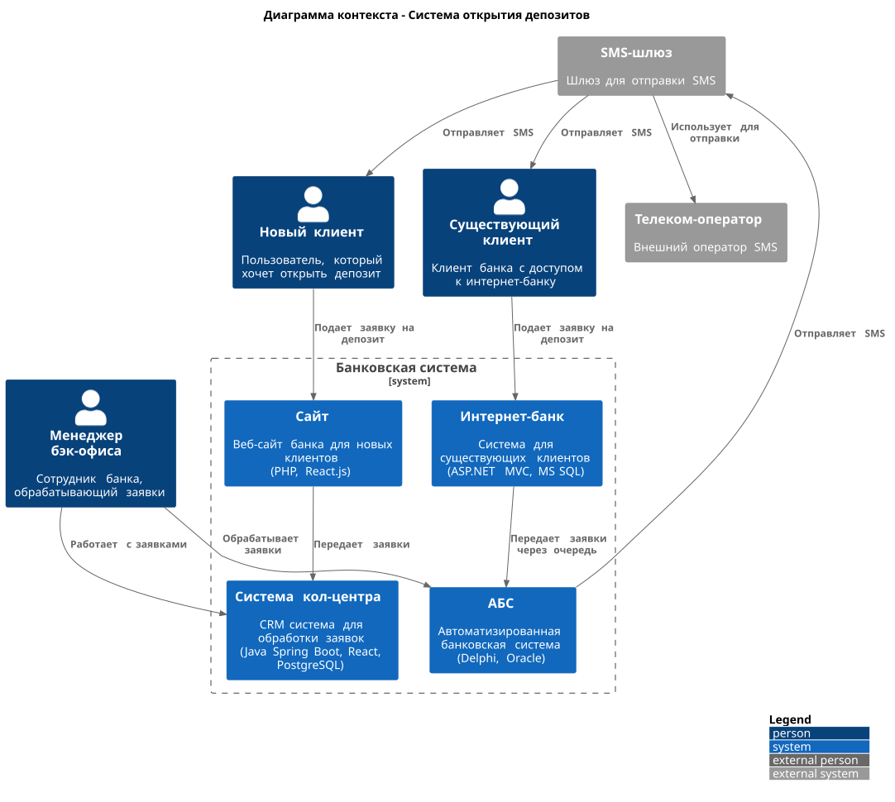
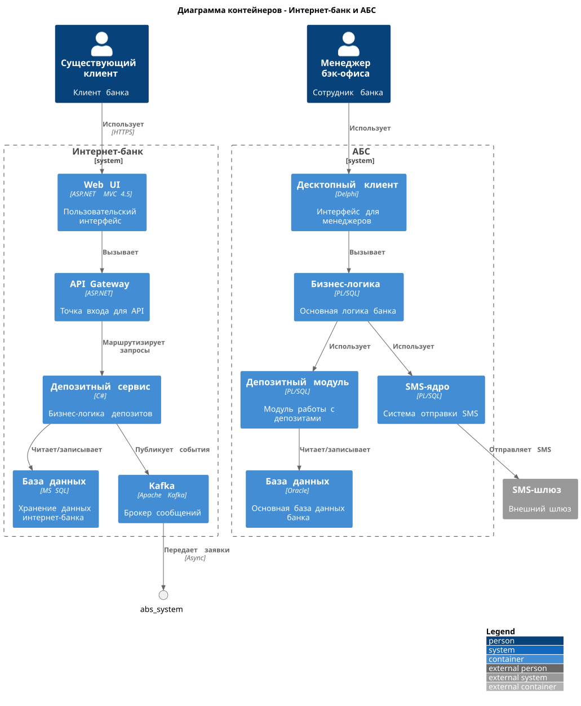

### **Название задачи:** 
### **Автор:**
### **Дата:**
### **Функциональные требования**
Опишите здесь верхнеуровневые Use Cases. Их нужно оформить в виде таблицы с пошаговым описанием:

|**№**|**Действующие лица или системы**|**Use Case**|**Описание**|
| :-: | :- | :- | :- |
|1|Новый клиент, Сайт, Кол-центр|Подача заявки на депозит с сайта|1. Клиент видит список депозитов с актуальными ставками<br>2. Клиент оставляет номер телефона и ФИО<br>3. Менеджер кол-центра звонит клиенту<br>4. Менеджер предлагает особые условия<br>5. Клиент приходит в отделение для идентификации|
|2|Существующий клиент, Интернет-банк, АБС|Подача заявки на депозит через интернет-банк|1. Клиент видит депозиты с персонализированными ставками<br>2. Клиент указывает счет и сумму депозита<br>3. Клиент подтверждает операцию SMS-кодом<br>4. Заявка создается в системе|
|3|Менеджер бэк-офиса, АБС|Обработка заявки на депозит|1. Менеджер получает заявку в АБС<br>2. Менеджер подтверждает условия депозита<br>3. Система отправляет SMS-уведомление о подтверждении ставки<br>4. Депозит открывается в АБС<br>5. Клиент получает SMS об открытии депозита|
|4|Сотрудник бэк-офиса, АБС|Управление ставками депозитов|1. Сотрудник обновляет ставки в XLS-файлах<br>2. Ставки синхронизируются с системами<br>3. Актуальные ставки отображаются на сайте и в интернет-банке
|

### **Нефункциональные требования**
Опишите здесь нефункциональные требования и архитектурно значимые требования.

|**№**|**Требование**|
| :-: | :- |
|1|Доступность 99,9% для всех сервисов (24/7)|
|2|Отклик по всем операциям в миллисекундах|
|3|Отказоустойчивость при сбоях ЦОД с переключением на резервный|
|4|Горизонтальное масштабирование интернет-банка|
|5|Шифрование трафика на сайте и в интернет-банке|
|6|Соблюдение корпоративной системы дизайна|
|7|Использование существующих технологий банка (MS SQL, Oracle)|
|8|Совместимость новых технологий с существующими платформами|
|9|Избежание прямой работы интернет-банка с API АБС|
|10|Минимизация доработок SMS-функционала подрядчиком
|


### **Решение**
Приведите диаграммы контекста и контейнеров в модели C4. Опишите там основные компоненты и интеграции всех элементов решения. 

Также опишите, какой логикой вы руководствовались в ходе принятия решений и выбора технологий. Не забывайте, что необходимо учесть все функциональные и нефункциональные требования.

---

Основные решения:
- Kafka для асинхронной обработки заявок (снижает нагрузку на АБС)
- Избегаем прямой интеграции интернет-банка с АБС
- Используем существующие технологии (MS SQL, Oracle)


Диаграмма контекста:


<details>
  <summary>c4 context plantuml</summary>

  ```plantuml
  @startuml deposit_context
    !include https://raw.githubusercontent.com/plantuml-stdlib/C4-PlantUML/master/C4_Context.puml

    LAYOUT_WITH_LEGEND()

    title Диаграмма контекста - Система открытия депозитов

    Person(new_client, "Новый клиент", "Пользователь, который хочет открыть депозит")
    Person(existing_client, "Существующий клиент", "Клиент банка с доступом к интернет-банку")
    Person(manager, "Менеджер бэк-офиса", "Сотрудник банка, обрабатывающий заявки")

    System_Boundary(bank_boundary, "Банковская система") {
        System(website, "Сайт", "Веб-сайт банка для новых клиентов\n(PHP, React.js)")
        System(internet_bank, "Интернет-банк", "Система для существующих клиентов\n(ASP.NET MVC, MS SQL)")
        System(abs_system, "АБС", "Автоматизированная банковская система\n(Delphi, Oracle)")
        System(call_center, "Система кол-центра", "CRM система для обработки заявок\n(Java Spring Boot, React, PostgreSQL)")
    }

    System_Ext(sms_gateway, "SMS-шлюз", "Шлюз для отправки SMS")
    System_Ext(telecom, "Телеком-оператор", "Внешний оператор SMS")

    Rel(new_client, website, "Подает заявку на депозит")
    Rel(existing_client, internet_bank, "Подает заявку на депозит")
    Rel(manager, abs_system, "Обрабатывает заявки")
    Rel(manager, call_center, "Работает с заявками")

    Rel(website, call_center, "Передает заявки")
    Rel(internet_bank, abs_system, "Передает заявки через очередь")
    Rel(abs_system, sms_gateway, "Отправляет SMS")
    Rel(sms_gateway, telecom, "Использует для отправки")
    Rel(sms_gateway, existing_client, "Отправляет SMS")
    Rel(sms_gateway, new_client, "Отправляет SMS")

    @enduml
  ```
</details>

Диаграмма контейнера (по сценарию с заявкой из интернет-банка):


<details>
  <summary>c4 container plantuml</summary>

  ```plantuml
  @startuml deposit_containers
!include https://raw.githubusercontent.com/plantuml-stdlib/C4-PlantUML/master/C4_Container.puml

LAYOUT_WITH_LEGEND()

title Диаграмма контейнеров - Интернет-банк и АБС

Person(existing_client, "Существующий клиент", "Клиент банка")
Person(manager, "Менеджер бэк-офиса", "Сотрудник банка")

System_Boundary(internet_bank_boundary, "Интернет-банк") {
    Container(web_ui, "Web UI", "ASP.NET MVC 4.5", "Пользовательский интерфейс")
    Container(api_gateway, "API Gateway", "ASP.NET", "Точка входа для API")
    Container(deposit_service, "Депозитный сервис", "C#", "Бизнес-логика депозитов")
    Container(internet_bank_db, "База данных", "MS SQL", "Хранение данных интернет-банка")
    Container(kafka_broker, "Kafka", "Apache Kafka", "Брокер сообщений")
}

System_Boundary(abs_boundary, "АБС") {
    Container(desktop_client, "Десктопный клиент", "Delphi", "Интерфейс для менеджеров")
    Container(business_logic, "Бизнес-логика", "PL/SQL", "Основная логика банка")
    Container(deposit_module, "Депозитный модуль", "PL/SQL", "Модуль работы с депозитами")
    Container(abs_db, "База данных", "Oracle", "Основная база данных банка")
    Container(sms_core, "SMS-ядро", "PL/SQL", "Система отправки SMS")
}

System_Ext(sms_gateway, "SMS-шлюз", "Внешний шлюз")

Rel(existing_client, web_ui, "Использует", "HTTPS")
Rel(web_ui, api_gateway, "Вызывает")
Rel(api_gateway, deposit_service, "Маршрутизирует запросы")
Rel(deposit_service, internet_bank_db, "Читает/записывает")
Rel(deposit_service, kafka_broker, "Публикует события")

Rel(manager, desktop_client, "Использует")
Rel(desktop_client, business_logic, "Вызывает")
Rel(business_logic, deposit_module, "Использует")
Rel(deposit_module, abs_db, "Читает/записывает")
Rel(business_logic, sms_core, "Использует")

Rel(kafka_broker, abs_system, "Передает заявки", "Async")
Rel(sms_core, sms_gateway, "Отправляет SMS")

@enduml
  ```
</details>

### **Альтернативы**
Опишите здесь наиболее важные альтернативные решения.

#### Альтернатива 1: Прямая интеграция интернет-банка с АБС

Простота реализации
Минус: перегрузка АБС, нарушение требований доступности

#### Альтернатива 2: Синхронная обработка заявок

Быстрая обратная связь клиенту
Минус: высокая нагрузка на АБС, низкая отказоустойчивость

#### Альтернатива 3: Полная микросервисная архитектура

Высокая масштабируемость
Минус: сложность реализации, большие затраты на MVP

### **Недостатки, ограничения, риски**
Подробно опишите здесь недостатки, ограничения и риски выбранного решения.

#### Недостатки:

- Текущая версия интернет-банка несовместима с Kafka (требует доработки)
- Ручная обработка заявок в MVP замедляет процесс
- Управление ставками через XLS-файлы создает риски ошибок

#### Ограничения:

- АБС масштабируется только вертикально
- Команда интернет-банка не может обеспечить требования доступности 99,9%
- Нельзя (нежелательно) дорабатывать SMS-функционал силами подрядчика

#### Риски:

- Перегрузка базы данных АБС при росте количества заявок
