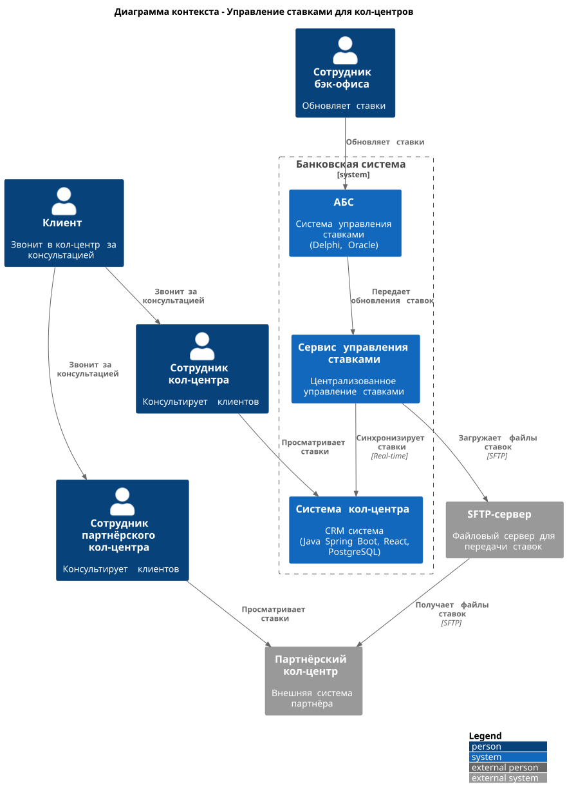
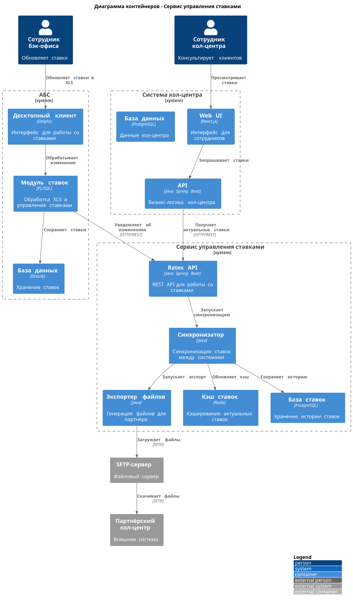
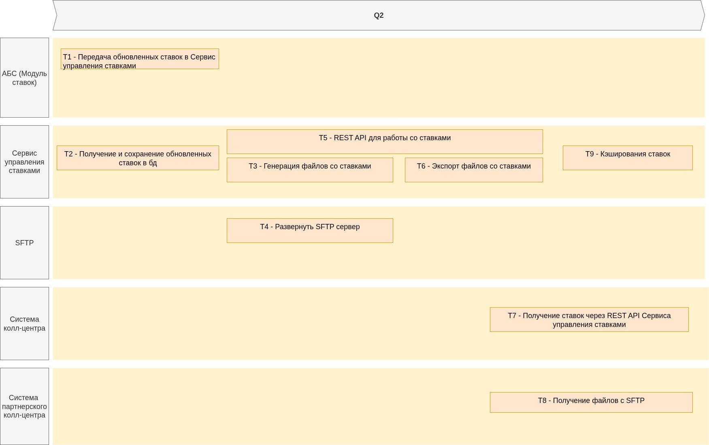

## Table of content
- [ADR](#adr)
- [Roadmap](#roadmap)
## ADR
### **Название задачи:** 
### **Автор:**
### **Дата:**
### **Функциональные требования**
Опишите здесь верхнеуровневые Use Cases. Их нужно оформить в виде таблицы с пошаговым описанием:

|**№**|**Действующие лица или системы**|**Use Case**|**Описание**|
| :-: | :- | :- | :- |
|1|Сотрудник кол-центра, Система кол-центра|Консультация по ставкам|1. Клиент звонит в кол-центр с вопросом о ставках<br>2. Сотрудник открывает систему кол-центра<br>3. Сотрудник видит актуальные ставки по депозитам<br>4. Сотрудник консультирует клиента|
|2|Сотрудник партнёрского кол-центра, Система партнёрского кол-центра|Консультация по ставкам (партнёр)|1. Клиент звонит в партнёрский кол-центр<br>2. Сотрудник открывает внешнюю систему<br>3. Сотрудник видит актуальные ставки из файла<br>4. Сотрудник консультирует клиента|
|3|Сотрудник бэк-офиса, АБС, Система управления ставками|Обновление ставок|1. Сотрудник обновляет ставки в XLS-файле<br>2. Система обрабатывает изменения<br>3. Ставки автоматически передаются в кол-центр<br>4. Ставки экспортируются в файл для партнёра|
|4|Система управления ставками, Партнёрский кол-центр|Передача ставок партнёру|1. Система генерирует файл с актуальными ставками<br>2. Файл передается по SFTP-протоколу<br>3. Партнёрский кол-центр получает файл<br>4. Система партнёра обновляет ставки|


### **Нефункциональные требования**
Опишите здесь нефункциональные требования и архитектурно значимые требования.

|**№**|**Требование**|
| :-: | :- |
|1|Передача файлов партнёру по защищенному SFTP-протоколу|
|2|Совместимость с текущим процессом работы с XLS-файлами|
|3|Логирование всех операций по передаче ставок|
|4|Возможность ручного запуска передачи ставок|
|5|Минимальные доработки существующих систем|

### **Решение**
Приведите диаграммы контекста и контейнеров в модели C4. Опишите там основные компоненты и интеграции всех элементов решения. 

Также опишите, какой логикой вы руководствовались в ходе принятия решений и выбора технологий. Не забывайте, что необходимо учесть все функциональные и нефункциональные требования.

---

Основные решения:
- Новый сервис управления ставками как центральный компонент
- REST API для кол-центра банка (реальное время)
- SFTP + файлы для партнёрского кол-центра (их ограничение)
- Redis для кэширования (быстрый доступ)

Основные риски:
- Рассинхронизация между системами
- Задержки у партнёра из-за файлового обмена
- Сложность мониторинга распределённой системы

Диаграмма контекста:


<details>
  <summary>c4 context plantuml</summary>

  ```plantuml
  @startuml rates_context
!include https://raw.githubusercontent.com/plantuml-stdlib/C4-PlantUML/master/C4_Context.puml

LAYOUT_WITH_LEGEND()

title Диаграмма контекста - Управление ставками для кол-центров

Person(client, "Клиент", "Звонит в кол-центр за консультацией")
Person(call_center_employee, "Сотрудник кол-центра", "Консультирует клиентов")
Person(partner_employee, "Сотрудник партнёрского кол-центра", "Консультирует клиентов")
Person(back_office_employee, "Сотрудник бэк-офиса", "Обновляет ставки")

System_Boundary(bank_boundary, "Банковская система") {
    System(abs_system, "АБС", "Система управления ставками\n(Delphi, Oracle)")
    System(rates_service, "Сервис управления ставками", "Централизованное управление ставками")
    System(call_center, "Система кол-центра", "CRM система\n(Java Spring Boot, React, PostgreSQL)")
}

System_Ext(partner_call_center, "Партнёрский кол-центр", "Внешняя система партнёра")
System_Ext(sftp_server, "SFTP-сервер", "Файловый сервер для передачи ставок")

Rel(client, call_center_employee, "Звонит за консультацией")
Rel(client, partner_employee, "Звонит за консультацией")

Rel(call_center_employee, call_center, "Просматривает ставки")
Rel(partner_employee, partner_call_center, "Просматривает ставки")
Rel(back_office_employee, abs_system, "Обновляет ставки")

Rel(abs_system, rates_service, "Передает обновления ставок")
Rel(rates_service, call_center, "Синхронизирует ставки", "Real-time")
Rel(rates_service, sftp_server, "Загружает файлы ставок", "SFTP")
Rel(sftp_server, partner_call_center, "Получает файлы ставок", "SFTP")

@enduml
  ```
</details>

Диаграмма контейнера:


<details>
  <summary>c4 container plantuml</summary>

  ```plantuml
  @startuml rates_containers
!include https://raw.githubusercontent.com/plantuml-stdlib/C4-PlantUML/master/C4_Container.puml

LAYOUT_WITH_LEGEND()

title Диаграмма контейнеров - Сервис управления ставками

Person(back_office_employee, "Сотрудник бэк-офиса", "Обновляет ставки")
Person(call_center_employee, "Сотрудник кол-центра", "Консультирует клиентов")

System_Boundary(abs_boundary, "АБС") {
    Container(abs_desktop, "Десктопный клиент", "Delphi", "Интерфейс для работы со ставками")
    Container(abs_rates_module, "Модуль ставок", "PL/SQL", "Обработка XLS и управление ставками")
    Container(abs_db, "База данных", "Oracle", "Хранение ставок")
}

System_Boundary(rates_service_boundary, "Сервис управления ставками") {
    Container(rates_api, "Rates API", "Java Spring Boot", "REST API для работы со ставками")
    Container(rates_sync, "Синхронизатор", "Java", "Синхронизация ставок между системами")
    Container(file_exporter, "Экспортер файлов", "Java", "Генерация файлов для партнёра")
    Container(rates_cache, "Кэш ставок", "Redis", "Кэширование актуальных ставок")
    Container(rates_db, "База ставок", "PostgreSQL", "Хранение истории ставок")
}

System_Boundary(call_center_boundary, "Система кол-центра") {
    Container(call_center_ui, "Web UI", "React.js", "Интерфейс для сотрудников")
    Container(call_center_api, "API", "Java Spring Boot", "Бизнес-логика кол-центра")
    Container(call_center_db, "База данных", "PostgreSQL", "Данные кол-центра")
}

System_Ext(sftp_server, "SFTP-сервер", "Файловый сервер")
System_Ext(partner_call_center, "Партнёрский кол-центр", "Внешняя система")

Rel(back_office_employee, abs_desktop, "Обновляет ставки в XLS")
Rel(abs_desktop, abs_rates_module, "Обрабатывает изменения")
Rel(abs_rates_module, abs_db, "Сохраняет ставки")

Rel(abs_rates_module, rates_api, "Уведомляет об изменениях", "HTTP/REST")
Rel(rates_api, rates_sync, "Запускает синхронизацию")
Rel(rates_sync, rates_cache, "Обновляет кэш")
Rel(rates_sync, rates_db, "Сохраняет историю")
Rel(rates_sync, file_exporter, "Запускает экспорт")

Rel(call_center_employee, call_center_ui, "Просматривает ставки")
Rel(call_center_ui, call_center_api, "Запрашивает ставки")
Rel(call_center_api, rates_api, "Получает актуальные ставки", "HTTP/REST")

Rel(file_exporter, sftp_server, "Загружает файлы", "SFTP")
Rel(sftp_server, partner_call_center, "Скачивает файлы", "SFTP")

@enduml
  ```
</details>

### **Альтернативы**
Опишите здесь наиболее важные альтернативные решения.

#### Альтернатива 1: Прямая интеграция кол-центра с АБС
- Простота архитектуры
- Минус: нагрузка на АБС, нет централизованного управления

#### Альтернатива 2: API-интеграция с партнёрским кол-центром
- Режим реального времени
- Минус: партнёр не может реализовать API

### **Недостатки, ограничения, риски**
Подробно опишите здесь недостатки, ограничения и риски выбранного решения.

#### Недостатки:

- Усложнение архитектуры добавлением нового сервиса
- Зависимость от файлового обмена с партнёром

#### Ограничения:

- Партнёрский кол-центр не может работать с API
- Текущий процесс работы с XLS-файлами нельзя кардинально менять
- Ограниченная экспертиза по новым технологиям в команде

#### Риски:

- Задержки в обновлении ставок у партнёра из-за файлового обмена
- Возможные сбои SFTP-сервера
- Рассинхронизация данных между системами
- Дополнительная нагрузка на сеть при частых обновлениях ставок
- Сложность мониторинга распределённой системы


## Roadmap
диаграмма в .drawio <br>
[Roadmap.xml](./roadmap.xml)

То же самое в виде картинки:


